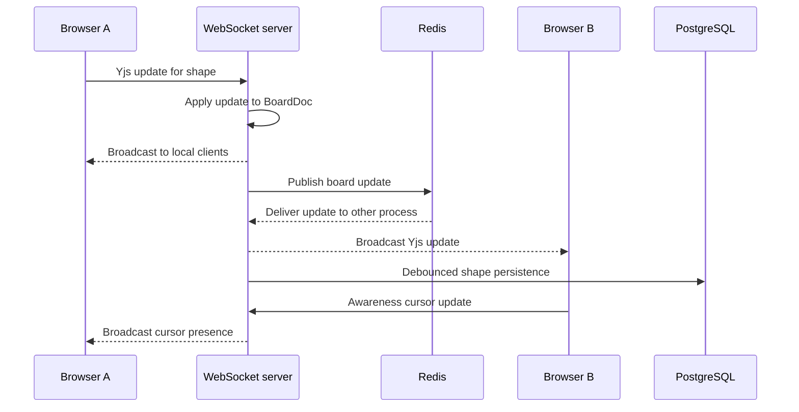

# Synchronization Design

## Why Yjs

Yjs is a CRDT library that allows each client to apply local changes immediately and merge concurrent changes without a central locking protocol. It matches the whiteboard requirement for collaborative edits and preserves the existing React, WebSocket, and PostgreSQL architecture.

## Shared document

Each board maps to one Yjs document and the `shapes` Y.Map. The map key is the stable canvas element ID and the value is the serialized element. The browser uses `y-websocket` to exchange Yjs sync protocol messages with the backend.

The backend keeps active documents in memory for low-latency fan-out and loads the durable shape rows from PostgreSQL when a room is first opened. Updates are persisted after a short debounce and when the final client leaves the room.

## Multi-instance propagation

The WebSocket process broadcasts local Yjs updates through the board's Redis channel. A receiving process applies the update with the `redis` origin, broadcasts it to its local clients, and does not publish it again. This keeps multiple backend instances convergent without creating an update loop.

## Presence and cursors

User name and cursor color are stored in Yjs Awareness state. Cursor coordinates are canvas coordinates, so pan and zoom do not change their meaning for other clients. Awareness is removed when the connection closes.

## Reconnection and offline edits

A client's Y.Doc remains alive while the WebSocket is disconnected. Local changes therefore remain in the document and are sent by the provider after reconnection. The current implementation does not persist a Y.Doc in IndexedDB, so edits must not be expected to survive a full page reload while offline.

## Authorization

The REST API and WebSocket handshake both resolve board permission. Public anonymous sessions receive view-only access. Yjs update messages are rejected for view-only sessions, while edit/admin/owner sessions may mutate the shared map.

## Limitations

- Active documents are process-local and Redis propagation is required when more than one backend instance is deployed.
- PostgreSQL persistence is debounced, so an abrupt process failure before the flush can lose the most recent few seconds of edits.
- Cursor latency and concurrent browser behavior still require live multi-client testing.
- MinIO stores explicit JSON snapshots; it is not an automatic version-history system.

## Collaborative edit sequence

